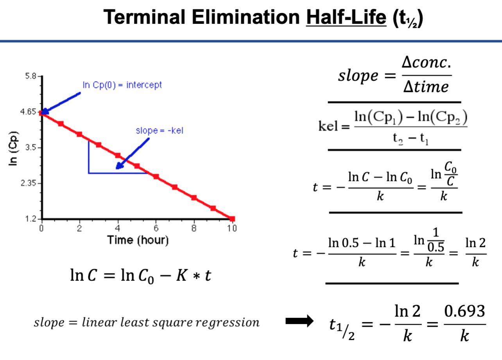

# This is Jeff's awesome website


Here is the link to the internet. I use [google](https://www.google.com/) all the time to do data science. 

This is a screen shot of the t 1/2 equation. )

```{r}
library(tidyverse)
#you can have code chunks in the output 
```

Here is the direct link to the [about](about.html) page. 


