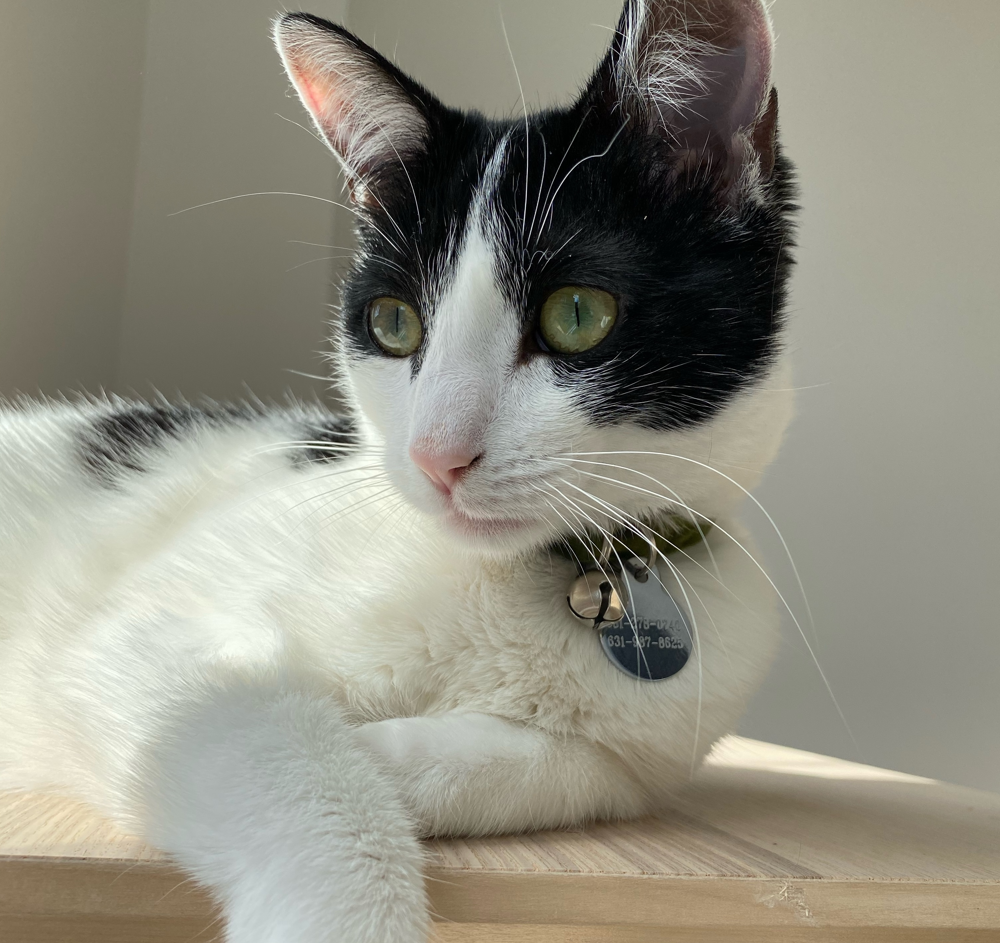

### Columbia University Mailman School of Public Health 
#### Department of Enirovnemntal Health Science 
##### Masters in Public Health Candidate ('23) 

# About 

I grew up in southeast Pennsylvania and I am a big Philadelphia sports fan. I enjoy cooking, hiking, camping, and finding new places to explore. I received a BS in biochemistry from [Arizona State University](https://sms.asu.edu/) in 2019. I am currently working towards completing my MPH from Columbia Mailman School of Public health. The focus of my MPH is in Toxicology within the Department of Environmental Health Science. In addition to my course work, I currently hold the role as a Lead TA for the the Determinants of Health class in the [Mailman CORE](https://www.publichealth.columbia.edu/academics/degrees/master-public-health/core-curriculum). I also hold a role as a research assistant in the Kupsco Lab lead by PI [Dr. Allison Kupsco](https://www.publichealth.columbia.edu/people/our-faculty/ak4181). 

# Additional

I have a dog named Winnie and a cat named Katya. 

### This is Winnie 

### This is Katya

# Direct Links 
Here is the direct link to the [resume](about.html) page. 

